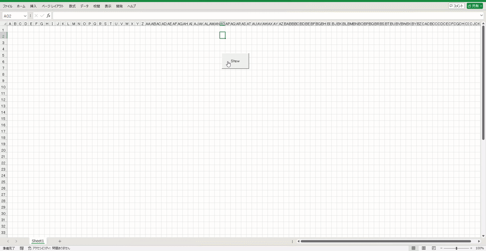

# **BouncyUserForm**
- BouncyUserForm は、**Excel VBA の UserForm を物理オブジェクトとして扱い、
重力・反発・空気抵抗・ダメージ表現を伴うアニメーションを実現するモジュール**です。
フォームをぶん投げてストレスを解消できます。
フォームが画面内を跳ね回り、衝突時にはコントロールが破損（非表示）します。
- 本コードでPCやデータに異常・損害が発生しても、作成者は一切責任を取りません。自己責任で遊んでください。

---
- BouncyUserForm is modules that treats an Excel VBA UserForm as a physical object, enabling animations with gravity, bouncing, air resistance, and damage effects.
You can throw the form around to relieve stress.
The form bounces around the screen, and when it collides with something, its controls can break (become hidden).
- The creator assumes no responsibility for any issues or damage to your PC or data caused by this code.
Use it at your own risk.


# 🧩拡張機能 / Extensions
以下のような拡張を自由に追加できます。
- OpenGL によるエフェクト
- Excel シートへのリアルタイム描画
- Excel 散布図による軌跡ログ
- 操作用 UI（コントローラー）
- カスタムエフェクト（ICFormPhysicsEf）
- カスタム拡張（ICFormPhysicsEx）
---
You can freely add optional extensions such as:
- OpenGL‑based visual effects
- Real‑time drawing onto an Excel worksheet
- Trajectory logging using Excel scatter charts
- A controller UI for manual operation
- Custom effects (via ICFormPhysicsEf)
- Custom extensions (via ICFormPhysicsEx)


# 💥Examples
- **拡張なし（最小構成）/ Minimal setup (no extensions)**


- **拡張あり（OpenGL 以外）/ With extensions (non‑OpenGL)**


- **OpenGL 拡張あり / With OpenGL extensions**


# 🐧 特徴 / Features
### 🧠物理エンジン / Physics Engine
- 重力シミュレーション
- 反発係数による跳ね返り
- 空気抵抗（速度依存）
- 衝突時のダメージ計算
- コントロールの破損（ランダム非表示）
- UserForm をドラッグして投げると物理挙動開始
- 画面端を壁として扱う衝突判定
- イベント通知（Move / Crash / Break / Started / Stopped）
---
- Gravity simulation
- Bounce with restitution coefficient
- Air resistance (velocity‑dependent)
- Damage calculation on impact
- Random control “breakage” (hidden on crash)
- Throw the UserForm by dragging it
- Screen edges act as collision walls
- Event callbacks: Move / Crash / Break / Started / Stopped
---
### 🎨描画レイヤー / Rendering Layer
- OpenGL による高速描画
- Excel シート描画
- Excel チャートログ
---
- High‑speed OpenGL rendering
- Excel worksheet rendering
- Excel scatter‑chart trajectory logging
---
### 💥エフェクト / Effects
- 爆発（glExplosion）
- 衝撃波（glShockWave）
- 移動残光（glMoveTrail）
- カスタムしたエフェクトを追加可能
---
- Explosion (glExplosion)
- Shockwave (glShockWave)
- Motion trail (glMoveTrail)
- Custom effects supported
---
### 🧩拡張 / Extensions
- Excel ロガー
- シートレンダラー
- コントローラー UI
- カスタムした拡張機能を追加可能
---
- Excel logger
- Worksheet renderer
- Controller UI
- Custom extension modules supported

# 🐧使い方 / Usage
## 1. クラスモジュールを追加 / Add the class modules
- **拡張なし（最小構成）/ Minimal setup (no extensions)**
```
(必須 / required)
+ CFormPhysics.cls
+ ICFormPhysicsEx.cls
```
- **拡張あり（OpenGL 以外）/ With extensions (non‑OpenGL)**
```
(必須 / required)
+ CFormPhysics.cls
+ ICFormPhysicsEx.cls
(任意 / optional)
+ CFormPhysicsLogger.cls
+ CFormPhysicsWsRenderer.cls
+ CFormPhysicsController.frm/frx
```
- **OpenGL 拡張あり / With OpenGL extensions**
```
(必須 / required)
+ CFormPhysics.cls
+ ICFormPhysicsEx.cls
+ ICFormPhysicsEf.cls
+ CFormPhysicsGLEffector.frm/frx
+ GLH.bas
+ OpenGL.cls
(任意 / optional)
+ glExplosion.cls
+ glShockWave.cls
+ glMoveTrail.cls
```

## 2. UserForm にコードを追加 / Add code to your UserForm
- **拡張なし（最小構成）/ Minimal setup (no extensions)**
```vb
Private engine As CFormPhysics
Private Sub UserForm_Initialize()
    Set engine = New CFormPhysics
    engine.Init Me
End Sub
Private Sub UserForm_Terminate()
    engine.Terminate
End Sub
```
- **拡張あり（OpenGL 以外）/ With extensions (non‑OpenGL)**
- 使いたい機能を第二引数のArrayに入れる
```vb
Private engine As CFormPhysics
Private Sub UserForm_Initialize()
    Set engine = New CFormPhysics
    engine.Init Me, Array(CFormPhysicsLogger, CFormPhysicsWsRenderer)
End Sub
Private Sub UserForm_Terminate()
    engine.Terminate
End Sub
```
- **OpenGL 拡張あり / With OpenGL extensions**
- CFormPhysicsGLEffectorを第二引数のArrayに入れ、
Crash時に発生するエフェクトを第三引数、Moveに時に発生するエフェクトを第四引数として設定する
```vb
Private engine As CFormPhysics
Private Sub UserForm_Initialize()
    Set engine = New CFormPhysics
    engine.init Me, Array(CFormPhysicsGLEffector), _
                    Array(glShockWave, _
                          glExplosion), _
                    Array(glMoveTrail)

End Sub
Private Sub UserForm_Terminate()
    engine.Terminate
End Sub
```
## 3. UserForm を表示 / Run the UserForm
- フォームをドラッグして投げると物理シミュレーションが開始します。
  ※タイトルバーではなく、ユーザーフォーム本体をドラッグしてください。
- Drag the form body (not the title bar) and release it to start the physics simulation.


# 📁フォルダ構成 / Folder Structure
```
src/
├─ core/
│   └─ CFormPhysics.cls
├─ interfaces/
│   ├─ ICFormPhysicsEx.cls
│   └─ ICFormPhysicsEf.cls
├─ rendering/
│   ├─ OpenGL/
│   │   ├─ OpenGL.cls
│   │   └─ GLH.bas
│   ├─ CFormPhysicsGLEffector.frm
│   ├─ CFormPhysicsWsRenderer.cls
│   └─ CFormPhysicsLogger.cls
├─ effects/
│   ├─ glExplosion.cls
│   ├─ glShockWave.cls
│   └─ glMoveTrail.cls
└─ controllers/
    └─ CFormPhysicsController.frm
```

# 🐧Requirements
- Windows + Excel (32‑bit / 64‑bit), likely Excel 2011 or later
- OpenGL (included with Windows)

# 🐧ライセンス / License
MIT License

