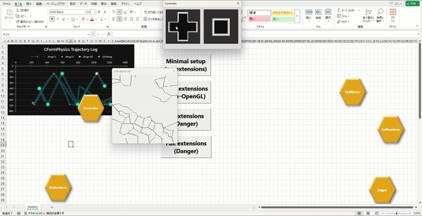

---


- BouncyUserForm は、Excel VBA の UserForm に物理エンジンを導入し、
インタラクティブなUIを実現することで、ユーザー体験と業務効率を同時に向上させる革新的フレームワークです。

- 重力・反発・空気抵抗などのパラメータを備え、ユーザーがフォームをドラッグして離すと、自然な慣性とともに業務が加速します。

- 衝突時には UI 要素が自動的に整理（非表示）されるため、不要なコントロールや業務を物理的に断捨離できます。

- 本コードでPCやデータに異常・損害が発生しても、作成者は一切責任を取りません。自己責任で業務を加速してください。

---
- BouncyUserForm introduces a physics engine into Excel VBA UserForms,
enabling an interactive UI that enhances both user experience and operational efficiency.

- Equipped with parameters such as gravity, restitution, and air resistance,
the form accelerates your workflow with natural inertia when you drag and release it.

- Upon collision, UI elements are automatically reorganized (hidden),
allowing you to physically declutter unnecessary controls — and unnecessary tasks.

- The creator assumes no responsibility for any issues or damage to your PC or data caused by this code.
Accelerate your workflow at your own risk.

# 🐧 特徴 / Features
### 🧠物理エンジン / Physics Engine
- 重力シミュレーション
- 反発係数による跳ね返り
- 空気抵抗（速度依存）
- 衝突時のダメージ計算
- コントロールの破損（ランダム非表示）
- UserForm をドラッグして投げると物理挙動開始
- 画面端を壁として扱う衝突判定
- イベント通知（Move / Crash / Break / Started / Stopped）
---
- Gravity simulation
- Bounce with restitution coefficient
- Air resistance (velocity‑dependent)
- Damage calculation on impact
- Random control “breakage” (hidden on crash)
- Throw the UserForm by dragging it
- Screen edges act as collision walls
- Event callbacks: Move / Crash / Break / Started / Stopped
---

# 🧩拡張機能 / Extensions
以下のような拡張やエフェクトを自由に追加できます。
- OpenGL によるエフェクト
- Excel シートへのリアルタイム描画
- Excel 散布図による軌跡ログ
- 操作用 UI（コントローラー）
- ボロノイ分割をベースにした亀裂表現
- 拡張機能を破壊する機能
- カスタムエフェクト（ICFormPhysicsEf）
- カスタム拡張（ICFormPhysicsEx）
---
You can freely add optional extensions such as:
- OpenGL‑based visual effects
- Real‑time drawing onto an Excel worksheet
- Trajectory logging using Excel scatter charts
- A controller UI for manual operation
- Voronoi-based crack representation
- A feature that disables extensions
- Custom effects (via ICFormPhysicsEf)
- Custom extensions (via ICFormPhysicsEx)


### 🧩拡張 / Extensions
|||
|---|---|
| Excel ロガー / Excel logger |  |
|シートレンダラー / Worksheet renderer||
|コントローラー UI / Controller UI||
|フォーム描画 / Form renderer||
|拡張破壊 / disables extensions||


### 💥エフェクト(OpenGL) / Effects(OpenGL)
|||
|---|---|
|爆発（glExplosion）||
|衝撃波（glShockWave）||
|移動残光（glMoveTrail）||
|コントロール破損(glControlShatter)||
|ダメージ表示（glHitNumber）||
|ステータス表示（glStatusVisualizer）||

# 🐧使い方 / Usage
## 1. クラスモジュールを追加 / Add the class modules
- **拡張なし（最小構成）/ Minimal setup (no extensions)**
```
(必須 / required)
+ CFormPhysics.cls
+ ICFormPhysicsEx.cls
```
- **拡張あり（OpenGL 以外）/ With extensions (non‑OpenGL)**
```
(必須 / required)
+ CFormPhysics.cls
+ ICFormPhysicsEx.cls
(任意 / optional)
+ CFormPhysicsLogger.cls
+ CFormPhysicsWsRenderer.cls
+ CFormPhysicsFmRenderer.cls
+ CFormPhysicsController.frm/frx
+ CFormPhysicsExtBreakable
```
- **OpenGL 拡張あり / With OpenGL extensions**
```
(必須 / required)
+ CFormPhysics.cls
+ ICFormPhysicsEx.cls
+ ICFormPhysicsEf.cls
+ CFormPhysicsGLEffector.frm/frx
+ GLH.bas
+ OpenGL.cls
(任意 / optional)
+ glExplosion.cls
+ glShockWave.cls
+ glMoveTrail.cls
+ glControlShatter.cls
+ glHitNumber.cls
+ glStatusVisualizer.cls
```

## 2. UserForm にコードを追加 / Add code to your UserForm
- **拡張なし（最小構成）/ Minimal setup (no extensions)**
```vb
Private engine As CFormPhysics
Private Sub UserForm_Initialize()
    Set engine = New CFormPhysics
    engine.Init Me
End Sub
Private Sub UserForm_Terminate()
    engine.Terminate
End Sub
```
- **拡張あり（OpenGL 以外）/ With extensions (non‑OpenGL)**
- 使いたい機能を第2引数のArrayに入れる
```vb
Private engine As CFormPhysics
Private Sub UserForm_Initialize()
    Set engine = New CFormPhysics
    engine.Init Me, Array(CFormPhysicsLogger, CFormPhysicsWsRenderer)
End Sub
Private Sub UserForm_Terminate()
    engine.Terminate
End Sub
```
- **OpenGL 拡張あり / With OpenGL extensions**
    - 引数2 : CFormPhysicsGLEffector
    - 引数3 : Crash時に発生するエフェクト
    - 引数4 : Move時に発生するエフェクト
    - 引数5 : コントロール破損エフェクト
    ---
    - Argument 2: CFormPhysicsGLEffector
    - Argument 3: Effect triggered during a crash
    - Argument 4: Effect triggered during movement
    - Argument 5: Control‑shatter effect
```vb
Private engine As CFormPhysics
Private Sub UserForm_Initialize()
    Set engine = New CFormPhysics
    engine.init Me, Array(CFormPhysicsController), _
                    Array(glShockWave, _
                          glExplosion), _
                    Array(glMoveTrail), _
                    Array(glControlShatter)

End Sub
Private Sub UserForm_Terminate()
    engine.Terminate
End Sub
```
## 3. UserForm を表示 / Run the UserForm
- フォームをドラッグして投げると物理シミュレーションが開始します。
  ※タイトルバーではなく、ユーザーフォーム本体をドラッグしてください。
- Drag the form body (not the title bar) and release it to start the physics simulation.

# 🐧Requirements
- Windows + Excel (32‑bit / 64‑bit), likely Excel 2011 or later
- OpenGL (included with Windows)

# 動作確認済み(Operation confirmed)
- Excel 2011(32bit)
- Excel 2024(64bit)

# 🐧ライセンス / License
MIT License

# 🐧デモファイル / Demo file
[Sample](sample.xlsm)

# 🔍 Search keywords
Excel physics engine, VBA animation, Excel game engine,
UserForm animation, OpenGL in VBA, Excel OpenGL, VBA graphics
